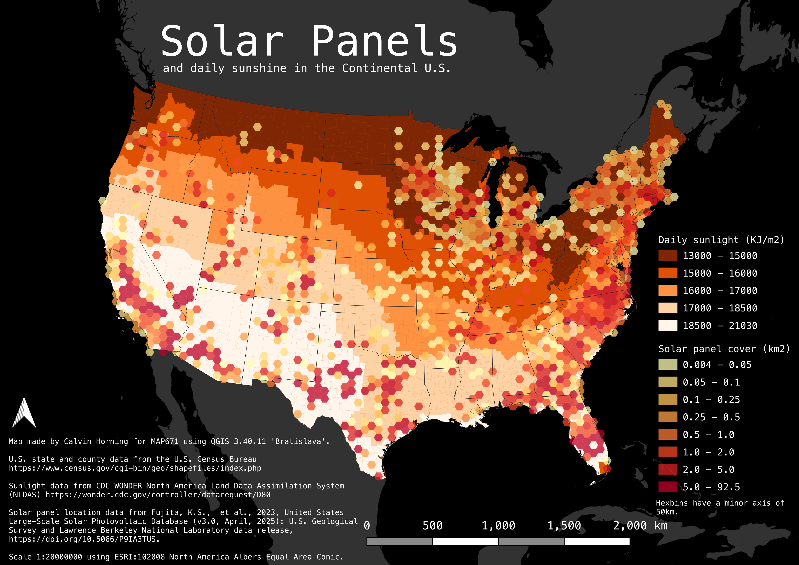

# Solar Panels and Daily Sunlight in the Continental United States

## Project Contents

If you wanted to include a table of contents to sections, and then links to each section.

- [Data Source](#data-source)
- [Project Background](#project-background)
- ....

***

### Data Source

[U.S. Census Bureau Shapefiles](https://www.census.gov/cgi-bin/geo/shapefiles/index.php)
[NLDAS Daily Sunlight Data](https://wonder.cdc.gov/nasa-insolar.html)
[U.S. Large-Scale Solar Photovoltaic Database](https://energy.usgs.gov/uspvdb/)

* Initial Data projection: EPSG:4269 NAD83 (first two sources, third has no geometry)
* Final Map projection: ESRI:102008

### Project Background

Initially I wanted to do a project based on maritime shipping in the U.S., but I was unable to find or put together a dataset that matched my needs. I had an idea based on the windmills dataset we worked with earlier to work with solar panel data, another form of renewable energy that requires a specific geography to be effective.

### Purpose

The purpose of this map is to consider the correlation between regions in the continental U.S. with significant solar farm investment and regions with (ostensibly) the best conditions for solar energy. One should be able to quickly and easily visually compare the two variables displayed on the map, and their relationship.

### Mapmaking Process

The process of making this map was somewhat harder than expected, though most of it went fine. I started by loading the states and counties TIGER/line data to form the basemap, and switching the map to ESRI:102008 for a solid projection of the United States. I then added the solar panel data, which was in the form of a CSV file with point data for individual solar farms. The process of creating a hexgrid that reflected the area of solar panels within each hex was as follows:

1. Create hexgrid using MMQGIS grid tool
2. Generate hexgrid with a 50km minor axis covering the continental U.S.
3. use "join attributes by location (summary)" tool in the processing toolbox
4. count and sum the area attribute of each solar farm in each hexgrid using that tool
5. Change the properties of the hexgrid to be graduated based on the newly created area(sum) attribute

The second part of the map involved styling the county layer according to the daily sunlight data. This part took a while, as I hoped to download the data as a CSV from the NLDAS, but the download would not work. Instead, I had to save the generated table as a PDF, copy and paste the data into a spreadsheet, separate the attributes in that spreadsheet so it could be joined to the shapefile, and export the data as a CSV. Having done so, I added the CSV without geometry to the map on QGIS. I then performed a join on the county layer using the GEOID as a join field to add the KJ/m2 data to that layer. Finally, I created a graduated style based on that new attribute which showed the amount of sunlight each county gets in an average day.

The last thing I did was to create a print layout and add all the pertinent information such as a title, scale, compass, legend, and metadata.

### Map summary

In my opinion, this map asks more questions than it answers, as the correlation one might expect (high sun & low density areas with the greatest presence of solar farms) does not appear to be very strong. Such questions one might seek to answer based on this map are: What is the political economy of solar farming? How do the government and private industry interact in the development of solar energy infrastructure? Why do some states such as North Carolina and Massachusetts have an unusually high rate of solar farming despite sub-optimal conditions?

## Final Project Link
Below is an image of the map:

Please view the [final map online](https://github.com/calvinhorning/us-solar-panels/blob/main/index.html)